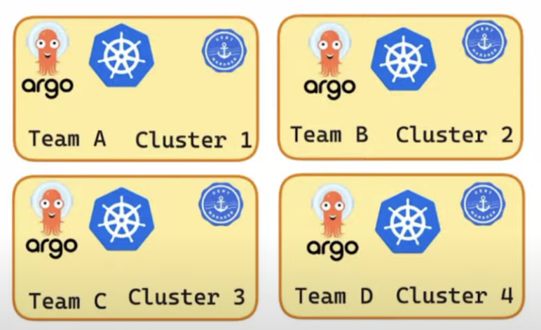
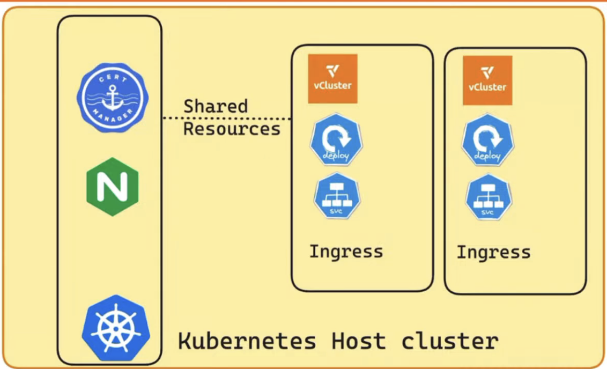
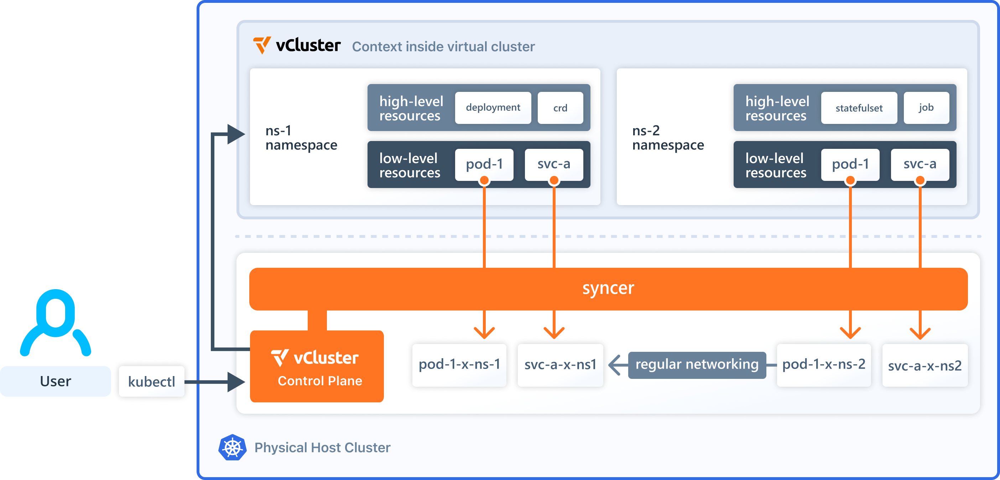

### What is the Problem (2*)

-  (Diagram from 2*) 
  - Cluster per team
  - Cluster per environment
  - Duplication of resources

  - COST? , Maintanence? 
  - SO MANY CLUSTERS

- Each team uses its own dedicated Kubernetes cluster, leading to high costs, duplicated tools like Argo CD, and increased maintenance effort. 
- Inefficiency of managing too many separate clusters for teams or environments.  

### How to do multi Tanency? (2*)

- Workload Isolation
  - Keep each tenant’s applications separate so they can’t affect or access each other.
- Tenant Autonomy
  - Let tenants manage their own environment independently.
- Fair Use of Resources 
  - Prevent one tenant from using too much CPU, memory, etc.

### What is the Shared platform stack (2*)

-  (Diagram from 2*) 
  - The Shared Platform Stack is a set of common services—such as Cert Manager, Ingress Controller, and core Kubernetes components—running on the host cluster and used by all isolated environment.

### Why Namespaces are not enough for multi-tenancy?

- Namespaces can provide soft isolation, but they’re not strong enough for secure, scalable multi-tenancy.

1. **Shared API Server**
- All tenants share the same Kubernetes API server, so RBAC misconfigurations can expose resources across tenants.

 2. **No Version Control**
- Tenants cannot use their own Kubernetes version (e.g., K8s 1.25 vs 1.27).
- Everyone is tied to the host cluster’s control plane version.

 3. **Global CRDs (Custom Resource Definitions)**
- If one tenant installs a CRD, it affects the whole cluster.
- Risk of conflict or version mismatch.

4. **Security Limitations**
- Even with NetworkPolicies and PSS (Pod Security Standards), a misconfigured privileged pod or escalation can affect other tenants.

5. **Limited Tenant Autonomy**
- Tenants can’t:
  - Create cluster-wide roles or bindings
  - Run admission controllers
    - An admission controller is a plugin that intercepts requests to the Kubernetes API server before they are saved to etcd (i.e., before the object is created or modified).
    - It can accept, reject, or modify those requests.
  - Customize scheduler behavior

### Why vCluster?

- To efficiently run multiple isolated Kubernetes environments on a single cluster, reducing cost and operational complexity

### What is vCluster?

- vCluster is a tool that creates virtual Kubernetes clusters—each with its own API server—inside a single physical Kubernetes cluster, offering better isolation than namespaces and lower cost than separate clusters.

### Architecture of vCluster

-  (Diagram from 1*) 

- A user uses **kubectl** to interact with the **vCluster control plane**, **not the physical host cluster** directly.

- The **vCluster control plane** is deployed **as a pod** in the host cluster.

- Each vCluster operates inside a namespace (e.g., ns-1, ns-2) of the physical cluster.

- Inside the vCluster, the user sees high-level Kubernetes resources like Deployments, CRDs, StatefulSets, and Jobs, just like in a regular cluster.

- A syncer component translates these resources into low-level resources (pods, services, etc.) in the host cluster's namespace, **adding suffixes** to avoid conflicts.

- **Networking is shared**, but **each vCluster is isolated by default**, ensuring strong multi-tenancy.

### Key Concepts

1. **vCluster Control Plane**
- A full Kubernetes control plane that runs inside a pod in the host cluster.
- Includes:
  - Kubernetes API server
  - Controller manager
  - Data store (like etcd, SQLite, etc.)
  - Syncer component (connects virtual and host cluster)

2. **Syncing Resources**
- vCluster runs your workloads by syncing pods from the virtual cluster to the host cluster

3. **Pod Scheduling**
- By default, vCluster reuses the host cluster scheduler to schedule workloads, but you can enable the virtual cluster's scheduler.

4. **Storage**
- vCluster allows using the host cluster’s StorageClasses directly.

- You don't need to define them in the virtual cluster if syncing from host to vCluster is enabled.

5. **Networking**
- Resources like Services and Ingresses are synced from virtual cluster to host cluster.

- This ensures that workloads in the vCluster are reachable via the host’s network infrastructure.

6. **Nodes**
- vCluster creates virtual/pseudo nodes based on pod .spec.nodeName values.

- These are not real nodes, but virtual representations within the vCluster to simulate scheduling and topology.

### Demo

For the demo, I utilized a post by Fabian Brundke as a reference -> [Demo.MD](./Demo.MD)

### References

(1*) https://www.vcluster.com/

(2*) [Workshop 1: Seamless Kubernetes Multi-Tenancy with vCluster and a Shared Platform Stack](https://www.youtube.com/live/HLCSbbQ_mQ8?si=x-vVRhSHFlHFQSSn&t=28)

(3*) [Solving Kubernetes Multi-tenancy Challenges with vCluster - By Fabian Brundke](https://liquidreply.net/news/solving-kubernetes-multi-tenancy-challenges-with-vcluster)
